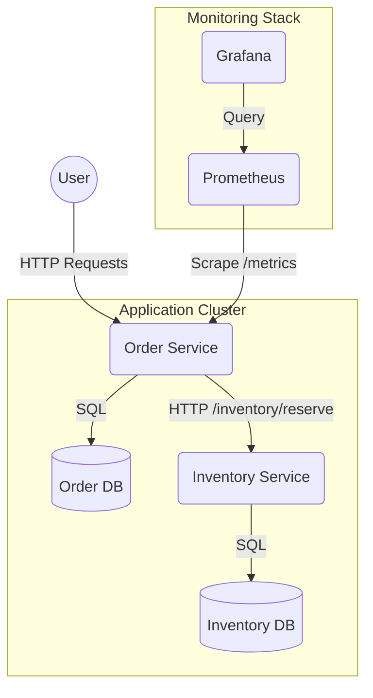

# 🚀 Use Case: production-Ready Observability & Reliability

This document explains the **SRE (Site Reliability Engineering)** upgrades applied to the Order and Inventory services. We moved from simple "uptime" monitoring to **User Experience Monitoring** using deep health checks and Golden Signal metrics.

---

## 🏗 Architecture Overview

We implemented a **Prometheus + Grafana** stack to monitor the services.



### Key Components
1.  **Order Service (`:3000`)**: The main entry point. Now instruments request latency.
2.  **Inventory Service (`:3001`)**: A critical dependency.
3.  **Prometheus (`:9091`)**: Collects metrics every 5 seconds.
4.  **Grafana (`:3002`)**: Visualizes data and alerts on poor user experience.

---

## 1️⃣ Deep Health Checks (Not just "200 OK")

We replaced shallow health checks with **Dependency-Aware Checks**. 

### Why?
A service is not "healthy" just because its server is running. It is only healthy if **it can do its job**.

### Implementation
- **Inventory Service (`/health`)**:
  - Pings the Database (`SELECT 1`).
  - If DB is down → Returns `503 Service Unavailable`.
  
- **Order Service (`/health`)**:
  - Pings its own Database.
  - **Calls Inventory Service's `/health` endpoint**.
  - If Inventory is down → Order Service returns `503` (Fail Fast).

**Try it:**
```bash
# Check detailed status
curl -s http://localhost:3000/health | jq
```
*Response:*
```json
{
  "service": "order-service",
  "status": "healthy",
  "checks": {
    "database": "connected",
    "inventoryService": "connected"
  }
}
```

---

## 2️⃣ Experience-First Monitoring (Latency)

We monitor **Latency** (Time taken to serve a request) because it directly impacts user happiness.

### Instrumentation
We use `prom-client` in `order-service/index.js` to measure how long every request takes.
- **Histogram**: `http_request_duration_seconds`
- **Buckets**: `0.1s, 0.5s, 1s, 2s, 5s`

### The Alert Rule
We defined a Service Level Objective (SLO): **"Average response time must be under 1 second."**

**Prometheus Query:**
```promql
rate(http_request_duration_seconds_sum[30s]) / rate(http_request_duration_seconds_count[30s])
```
- If this value > **1.0s**, the dashboard turns **RED**.

---

## 3️⃣ How to Validate (Simulations)

We built tools to prove the monitoring works.

### A. Simulate High Latency (The "Red Screen" Test)
We added "Chaos Middleware" to the Order Service that accepts a `?latency=ms` query parameter.

**1. Open Grafana:** [http://localhost:3002](http://localhost:3002) (Login: `admin` / `admin`)
**2. Run this "Stress Test" command:**
```bash
# Send requests that take 2 seconds (2000ms) to complete
while true; do 
  curl -s -X POST "http://localhost:3000/orders?latency=2000" \
  -H "Content-Type: application/json" \
  -d '{"productId": "123", "quantity": 1}' > /dev/null
  echo "Request sent with 2s latency..."
done
```
**3. Watch the Dashboard:**
- Within ~15-30 seconds, the "Average Latency" gauge will rise.
- Once it crosses **1s**, it will turn **RED**. 🔴
- Stop the command (`Ctrl+C`), and it will return to **GREEN**. 🟢

### B. Simulate Dependence Failure
What happens if the Inventory Service dies?

**1. Kill Inventory Service:**
```bash
docker stop inventory-service
```

**2. Check Order Service Health:**
```bash
curl -s http://localhost:3000/health | jq
```
**Result:**
```json
{
  "service": "order-service",
  "status": "unhealthy", <--- DETECTED!
  "checks": {
    "database": "connected",
    "inventoryService": "disconnected" <--- ROOT CAUSE FOUND
  }
}
```
This proves the Order Service knows it is broken immediately, without waiting for user timeouts.

**3. Fix it:**
```bash
docker start inventory-service
```

---

## 📝 Metric Endpoints for debugging
- **Prometheus Metrics**: [http://localhost:3000/metrics](http://localhost:3000/metrics)
- **Prometheus UI**: [http://localhost:9091](http://localhost:9091)
- **Grafana**: [http://localhost:3002](http://localhost:3002)
